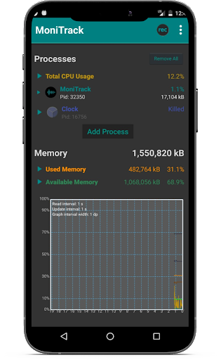
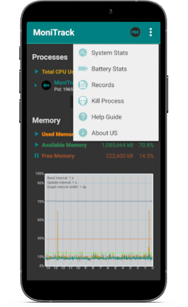
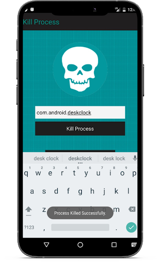
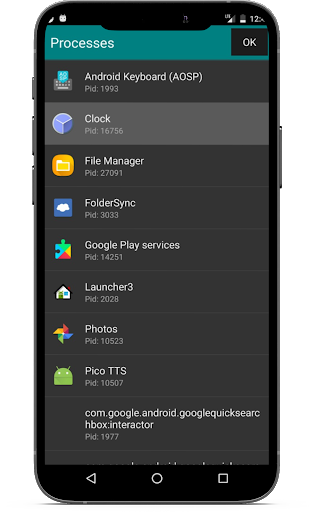

# MoniTrack #

.

## How it works ##

MoniTrackapp allows you to monitor and track CPU and Memory Usage of processes of your choice. In addition, you can:

* View System Statistics
* View Battery Statistics
* Record CPU and Memory Tracking
* Load Records
* Store Record and Upload to Dropbox
* Kill Processes

	<h3>  Action bar </h3>
	This is the bar at the top. It consists of the application's name, a record/stop button and a three-dot dropdown.

	Record/Stop button: start/stop recording of CPU and Memory tracking. Once stopped, a csv is saved in the DropSync folder allocated by your Dropbox application.

	Three-dot dropdown: Navigate to other pages of the application other than the home screen, including this help guide.

	<h3> Home Screen </h3>

	The Home Screen consists of three panels:
		Process Panel, Memory Panel, and Graph Panel.

	<h3> Process Panel </h3>

	This lists all the processes being tracked. Click "Add Process" to add other running processes to the list and track them. You will see the name as well as the Process ID (denoted by Pid).

	Click on the Memory or CPU Usage button in the top right to toggle between displaying the memory and cpu values of the processes.

	If the device has multiple cores, it displays the combined aggregate.

	<h3> Memory Panel </h3>

	This shows the device's memory parameters.

	* Used Memory: Memory currently in use.
	* Available Memory: Memory available. It is equivalent to "Free Memory" + "Cached Memory".
	* Free Memory: The amount of memory currently free for use.
	* Cached Memory:the in-memory cache.
	* Limit: Android's set limit for Available Memory at which it is too low and gets killed by Android. This is not native to Linux.
	

	<h3> Graph Panel </h3>

	The graph shows the cpu and memory usage over time. If you click on the rec button at the top, you can start recording the graph values. Upon clicking the button again, you can stop recording and the csv will be saved to your device and DropboxSync.

	<h3> System Stats </h3>
	This lists operating system statistics by effectively running shell commands and displaying the output. The "TOP" button will run "top" and the "CPU Info" button will display the CPU information and the "Device Info" will display the information about the device.

	<h3> Battery Stats </h3>
	This lists battery statistics by reading from system files (in sys/class/power_supply/battery). You can see:

	* Battery Status: Whether it is charging or not
	* Battery Capacity: Maximum power compared to when first manufactured
	* Battery Health: How well does the battery perform
	* Battery Technology: The technology of the battery

	You can click "Power Usage Summary" to go to the summary of your power usage from your system.

	<h3> Records </h3>
	Click on "Load Recording" to open a file picker. Open a previously saved csv file of a tracking record and it will be displayed.

	<h3> Kill Process </h3>
	You can enter the package name of the process in the textbox and the application
	will kill the process with that name by using a system service. You can click
	on "View Running Processes" to see System Stats and find the names of running
	processes with package names.	
